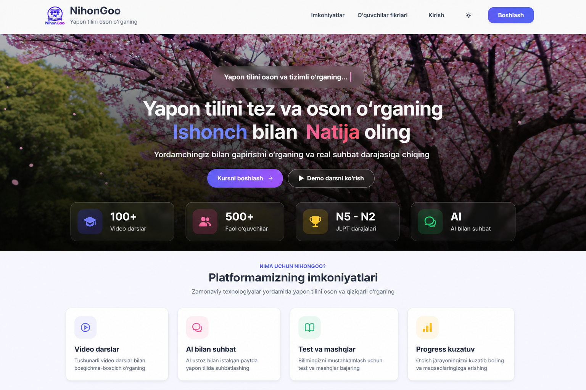
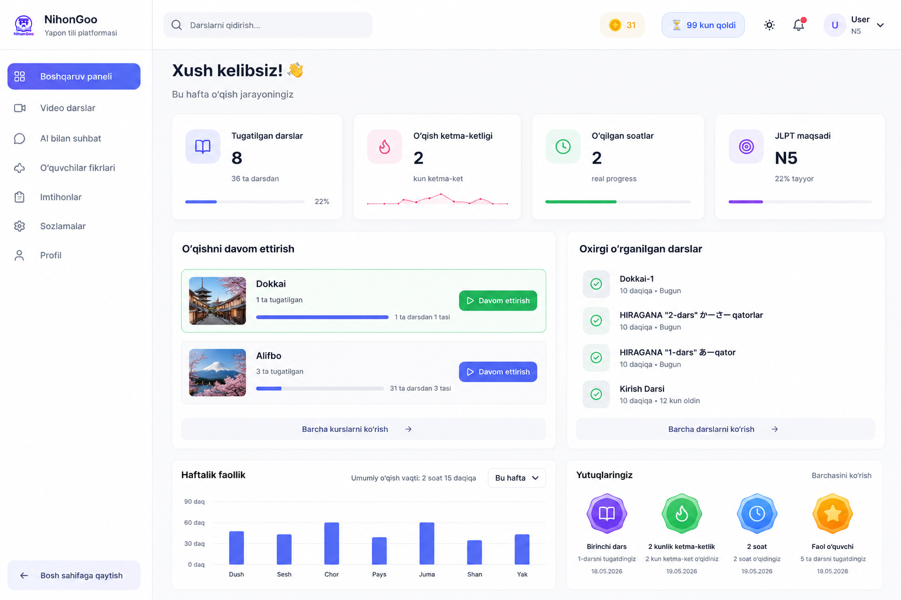
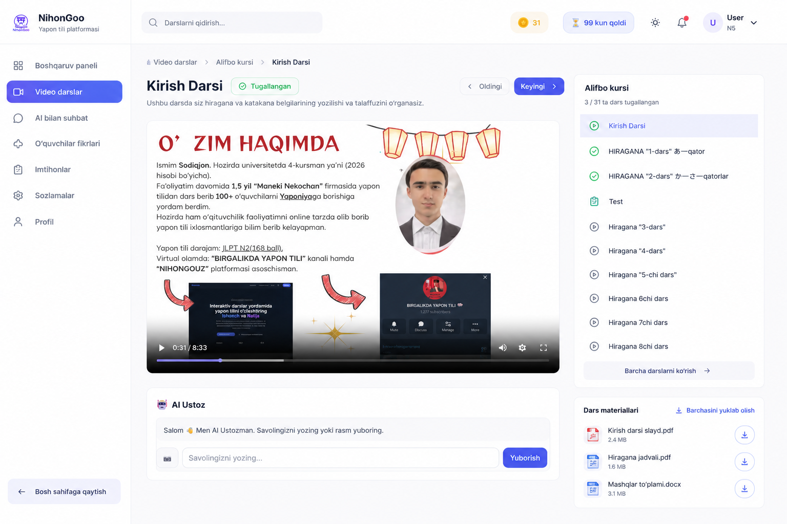
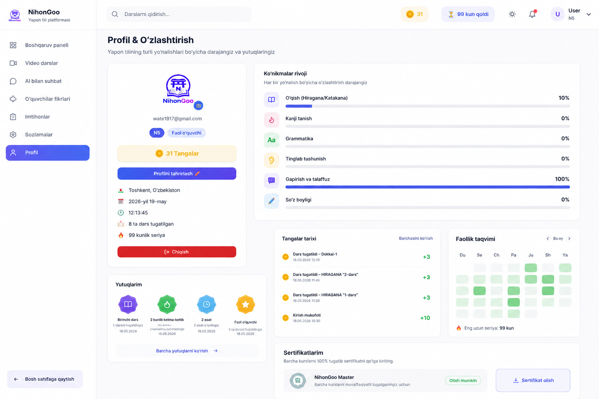

# NihonGoo - Japanese Learning Platform 🇯🇵

Modern Japanese learning platform focused on JLPT preparation, interactive learning experience, and AI-powered education tools.

---

# 🌐 Live Demo

👉 https://nihongoo.uz

---

# 🚀 Main Features

- 🎓 Interactive JLPT lessons
- 🤖 AI Learning Assistant
- 📈 Progress Tracking System
- 🪙 Coins & Rewards System
- 👤 User Dashboard & Profile
- 🏆 Achievements & Rankings
- 📱 Fully Responsive UI
- 🌙 Modern Japanese-inspired Design

---

# 🛠 Tech Stack

| Technology | Usage |
|---|---|
| Next.js | Frontend Framework |
| TypeScript | Type Safety |
| Supabase | Backend & Database |
| Tailwind CSS | UI Styling |
| Vercel | Deployment |
| PostgreSQL | Database |
| OpenAI API | AI Features |

---

# 🏗 System Architecture

```txt
User
 ↓
Next.js Frontend
 ↓
Supabase Backend
 ↓
PostgreSQL Database
 ↓
AI Assistant Integration
```

---

# 🏠 Home Page



---

# 📊 Dashboard



---

# 🎓 Lesson Page



---

# 👤 Profile Page



---

# ⚡ Performance & UX

- Fast page loading
- Mobile-first design
- Optimized UI/UX
- Modern dashboard system
- Smooth animations
- Secure authentication

---

# 💡 Project Purpose

NihonGoo was created to help Japanese learners prepare for JLPT exams through a modern and engaging learning experience.

The platform combines:
- structured learning,
- AI support,
- gamification,
- and progress analytics.

---

# 🔒 Source Code Notice

This repository is a showcase version.

Core backend systems, authentication logic, payment systems, and business-related infrastructure are private for security and commercial reasons.

---

# ⚙️ Local Installation

```bash
npm install
npm run dev
```

---

# 👨‍💻 Developer

Sodiqjon Rustamjonov

- Frontend & Backend Developer
- JLPT Learner
- EdTech Platform Builder

🌐 https://nihongoo.uz

---

# 📬 Contact
- Gmail: wate1917@gmail.com
- Telegram: https://t.me/nihongosenpai
- LinkedIn: https://www.linkedin.com/in/sodiqjon-rustamjonov-b4aab1334

---

# ⭐ Future Plans

- Mobile Application
- AI Speaking Practice
- JLPT Mock Exams
- Community Features
- Video Streaming System
- Japanese Teacher Dashboard
